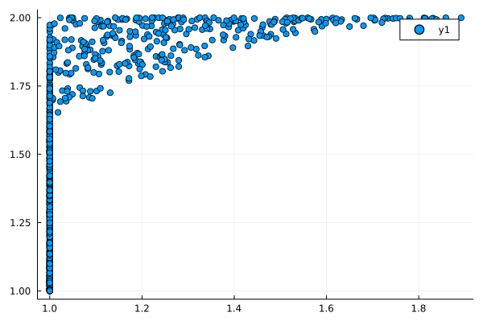
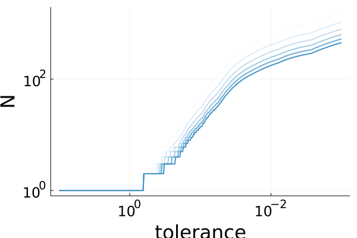
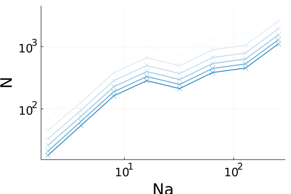

# NuSynthesis

[](https://kjellqvist.github.io/NuSynthesis.jl/dev)

A julia package to recreate the numerical results of the paper Nu-analysis: A new notion of robustness for large systems with structured uncertainties.

The paper is scheduled for presentation at the [CDC22](https://cdc2022.ieeecss.org/) and can be found [on Arxiv](https://arxiv.org/abs/2204.05359).

## Installation

```
using Pkg;
Pkg.add(url="https://github.com/kjellqvist/NuSynthesis.jl")
```

## Examples

The scripts in the `examples` directory were used to generate the numerical examples.
The scatter plot was generated by `examples/scatter_plot.jl`.



`examples/run_exp.jl` will run simulations and store it in a julia data file. 
`examples/plot_stuff.jl` will read from this data file and store the plots below and `.csv` files.




